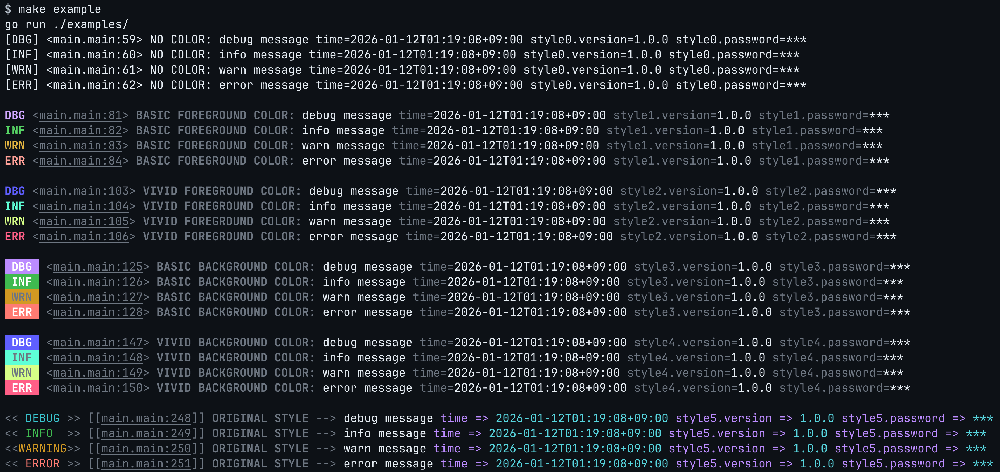

<p align="center">
  <h2 align="center">LOGGER</h2>
  <p align="center">A customizable, minimal, zero-allocation logger for Go CLI</p>
  <p align="center">
    <a href="https://github.com/nekrassov01/logger/actions/workflows/ci.yml"></a>
    <a href="https://codecov.io/gh/nekrassov01/logger"></a>
    <a href="https://pkg.go.dev/github.com/nekrassov01/logger"></a>
    <a href="https://goreportcard.com/report/github.com/nekrassov01/logger"></a>
    
    <a href="https://deepwiki.com/nekrassov01/logger"></a>
  </p>
</p>

## Overview

`logger` is a high-performance, customizable logging library designed for Go CLI applications. It acts as a wrapper around the standard `log/slog` package, providing a polished, colorful, and human-friendly output format by default.

## Features

- log/slog compatible
- Zero allocation in hot paths
- Rich coloring
- Flexible styling

## Example

[examples/main.go](./examples/main.go)



## Benchmarks

[benchmarks/benchmark_test.go](./benchmarks/benchmark_test.go)

```text
$ make bench
go test -bench . -benchmem -count 5 -benchtime=10000x -cpuprofile=cpu.prof -memprofile=mem.prof ./benchmarks/
goos: darwin
goarch: arm64
pkg: github.com/nekrassov01/logger/benchmarks
cpu: Apple M2
BenchmarkCLIHandler_Basic-8                10000              1563 ns/op            2098 B/op          0 allocs/op
BenchmarkCLIHandler_Basic-8                10000               952.3 ns/op          2098 B/op          0 allocs/op
BenchmarkCLIHandler_Basic-8                10000               791.6 ns/op          2098 B/op          0 allocs/op
BenchmarkCLIHandler_Basic-8                10000               766.9 ns/op          2098 B/op          0 allocs/op
BenchmarkCLIHandler_Basic-8                10000               623.3 ns/op          2098 B/op          0 allocs/op
BenchmarkCLIHandler_Basic_Parallel-8       10000               746.8 ns/op          2102 B/op          0 allocs/op
BenchmarkCLIHandler_Basic_Parallel-8       10000               715.4 ns/op          2100 B/op          0 allocs/op
BenchmarkCLIHandler_Basic_Parallel-8       10000               694.5 ns/op          2102 B/op          0 allocs/op
BenchmarkCLIHandler_Basic_Parallel-8       10000               644.6 ns/op          2103 B/op          0 allocs/op
BenchmarkCLIHandler_Basic_Parallel-8       10000               618.3 ns/op          2102 B/op          0 allocs/op
BenchmarkCLIHandler_Attr-8                 10000              2318 ns/op            3630 B/op          8 allocs/op
BenchmarkCLIHandler_Attr-8                 10000              2295 ns/op            3629 B/op          8 allocs/op
BenchmarkCLIHandler_Attr-8                 10000              2218 ns/op            3629 B/op          8 allocs/op
BenchmarkCLIHandler_Attr-8                 10000              2190 ns/op            3628 B/op          8 allocs/op
BenchmarkCLIHandler_Attr-8                 10000              2148 ns/op            3629 B/op          8 allocs/op
BenchmarkCLIHandler_Attr_Parallel-8        10000              2322 ns/op            2375 B/op          8 allocs/op
BenchmarkCLIHandler_Attr_Parallel-8        10000              2312 ns/op            2374 B/op          8 allocs/op
BenchmarkCLIHandler_Attr_Parallel-8        10000              2660 ns/op            2375 B/op          8 allocs/op
BenchmarkCLIHandler_Attr_Parallel-8        10000              2570 ns/op            2373 B/op          8 allocs/op
BenchmarkCLIHandler_Attr_Parallel-8        10000              2783 ns/op            2375 B/op          8 allocs/op
PASS
ok      github.com/nekrassov01/logger/benchmarks        0.772s
```

## Installation

```bash
go get github.com/nekrassov01/logger
```

## Todo

- [ ] Integration with SDKs other than AWS SDK

## Author

[nekrassov01](https://github.com/nekrassov01)

## License

[MIT](https://github.com/nekrassov01/logger/blob/main/LICENSE)
