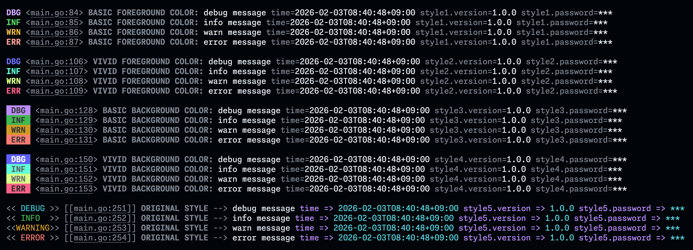
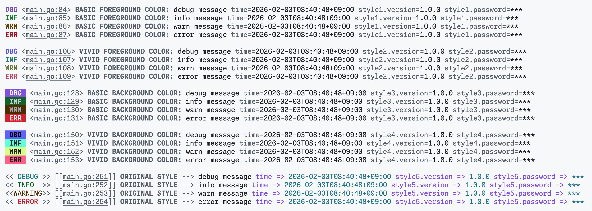

<p align="center">
  <h2 align="center">LOGGER</h2>
  <p align="center">A customizable, minimal, zero-allocation logger for Go CLI</p>
  <p align="center">
    <a href="https://github.com/nekrassov01/logger/actions/workflows/ci.yml"></a>
    <a href="https://codecov.io/gh/nekrassov01/logger"></a>
    <a href="https://pkg.go.dev/github.com/nekrassov01/logger"></a>
    <a href="https://goreportcard.com/report/github.com/nekrassov01/logger"></a>
    
    <a href="https://deepwiki.com/nekrassov01/logger"></a>
  </p>
</p>

## Overview

`logger` is a high-performance, customizable logging library designed for Go CLI applications. It acts as a wrapper around the standard `log/slog` package, providing a polished, colorful, and human-friendly output format by default.

## Features

- log/slog compatible
- Zero allocation in hot paths
- Rich coloring
- Flexible styling

## Example

[examples/main.go](./examples/main.go)

dark



light



## Benchmarks

[benchmarks/benchmark_test.go](./benchmarks/benchmark_test.go)

```text
$ go test -bench . -benchmem -count 5 -benchtime=100000x ./benchmarks/
goos: darwin
goarch: arm64
pkg: github.com/nekrassov01/logger/benchmarks
cpu: Apple M2
BenchmarkCLIHandler_Basic-8             100000               601.7 ns/op             0 B/op          0 allocs/op
BenchmarkCLIHandler_Basic-8             100000               434.7 ns/op             0 B/op          0 allocs/op
BenchmarkCLIHandler_Basic-8             100000               453.6 ns/op             0 B/op          0 allocs/op
BenchmarkCLIHandler_Basic-8             100000               408.0 ns/op             0 B/op          0 allocs/op
BenchmarkCLIHandler_Basic-8             100000               447.0 ns/op             0 B/op          0 allocs/op
BenchmarkCLIHandler_Basic_Parallel-8    100000               191.7 ns/op             0 B/op          0 allocs/op
BenchmarkCLIHandler_Basic_Parallel-8    100000               169.2 ns/op             0 B/op          0 allocs/op
BenchmarkCLIHandler_Basic_Parallel-8    100000               176.8 ns/op             0 B/op          0 allocs/op
BenchmarkCLIHandler_Basic_Parallel-8    100000               158.7 ns/op             0 B/op          0 allocs/op
BenchmarkCLIHandler_Basic_Parallel-8    100000               174.0 ns/op             0 B/op          0 allocs/op
BenchmarkCLIHandler_Attr-8              100000               967.8 ns/op             0 B/op          0 allocs/op
BenchmarkCLIHandler_Attr-8              100000               949.6 ns/op             0 B/op          0 allocs/op
BenchmarkCLIHandler_Attr-8              100000               989.3 ns/op             0 B/op          0 allocs/op
BenchmarkCLIHandler_Attr-8              100000               943.7 ns/op             0 B/op          0 allocs/op
BenchmarkCLIHandler_Attr-8              100000               949.6 ns/op             0 B/op          0 allocs/op
BenchmarkCLIHandler_Attr_Parallel-8     100000               231.1 ns/op             0 B/op          0 allocs/op
BenchmarkCLIHandler_Attr_Parallel-8     100000               231.2 ns/op             0 B/op          0 allocs/op
BenchmarkCLIHandler_Attr_Parallel-8     100000               231.7 ns/op             0 B/op          0 allocs/op
BenchmarkCLIHandler_Attr_Parallel-8     100000               235.5 ns/op             0 B/op          0 allocs/op
BenchmarkCLIHandler_Attr_Parallel-8     100000               231.9 ns/op             0 B/op          0 allocs/op
PASS
ok      github.com/nekrassov01/logger/benchmarks        1.250s
```

## Installation

```bash
go get github.com/nekrassov01/logger
```

## Todo

- [ ] Integration with SDKs other than AWS SDK

## Author

[nekrassov01](https://github.com/nekrassov01)

## License

[MIT](https://github.com/nekrassov01/logger/blob/main/LICENSE)
